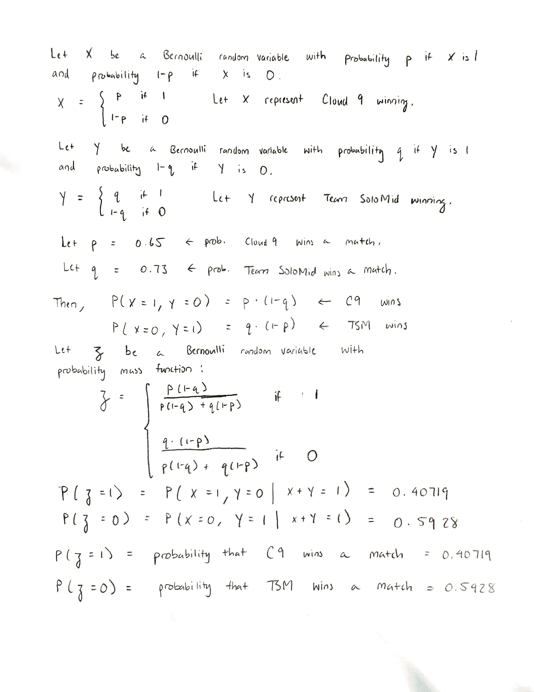

```{r setup, include=FALSE}
knitr::opts_chunk$set(echo = TRUE)
```

```{r, echo = F}
suppressWarnings(suppressMessages(library(tidyverse)))
suppressWarnings(suppressMessages(library(knitr)))
suppressWarnings(suppressMessages(library(xlsx)))
opts_chunk$set(tidy.opts=list(width.cutoff=80),tidy=TRUE)
```
\pagenumbering{gobble}

\newpage
\pagenumbering{arabic}
# Introduction
|        League of Legends (abbreviated as LoL) is a multiplayer online battle arena game developed and published by Riot Games. In LoL, there are two teams of 5 players where the main objective of the game is to destroy the opposing team's "Nexus", a structure that is heavily defended in the center of each team's territory. Since LoL's inception in 2009, the game has experienced tremendous growth with over 100 million active monthly players in 2020. With such a large playerbase, LoL has developed an extremely active international professional scene. There are professional leagues worldwide such as in North America, Europe, China, South Korea, and many more regions for top level professional LoL. These professional leagues consist of teams that play one another in regional competitions which culminate with an annual World Championship. 

|        The initial goal of this paper is to model win probability specifically for professional teams in the North American region. The ability to predict match outcomes between two teams from win probabilities generated by a model is naturally a valuable tool for the betting industry. A significant amount of money is usually involved and people will always search for a slight edge in order to make more accurate predictions. In addition to benefitting the betting market, a model for win probability also provides insight into the game itself by identifying elements that have the most influence in determining a match's outcome. 

|        The second goal of the paper is to then simulate head to head matches between two professional North American teams using the win probabilities generated for each team from the model mentioned above. These simulations will follow Condorcet's model for majority voting. The original context in which Condorcet applies the majority voting model is in a courtroom where a jury must arrive at a $Yes$ decision. There are an odd number of voters in the jury and each voter has probability, $p$, of voting $Yes$ and probability, $1-p$, of voting $No$. Condorcet then determines the probability that the majority of voters vote $Yes$. In the context of LoL matches, an odd series of $n$ head to head matches played between two professional LoL teams will represent the number of voters in the jury. Similarly each game will have probability, $p$, of Team A winning and probability, $1-p$, of Team B winning. I wish to determine the probability that Team A will win the majority of their games against Team B. For example, if there is a series of five games that the teams must play, I wish to find the probability that Team A wins the majority of these five games. I will then verify Condorcet's Jury Theorem in the context of LoL matches. This section of the paper involving Condorcet's Jury Theorem and his model for majority voting will be discussed in more detail after the creation and explanation of the win probability model.

# Derivation & Explanation of Win Probability Model
|        A logistic regression model will be used to model win probability since the dependent observation we wish to observe, match outcome, is binary with values being either 1 (win) or 0 (loss). Thus match outcome, follows a Bernoulli distribution with unknown probability, $p$. The logistic regression model will estimate the value of $p$ for any given linear combination of independent variables that we choose for our model. The independent variables chosen for our model will be the following selected data for any given match:

* towerKills: The amount of enemy towers each team destroys
* baronKills: The number of times a team killed Baron Nashor
* deaths: The total death count for each team 
* gold_spent_percentage_diff: The percentage difference of gold spent between a team and the opposing team

\newpage
From our chosen independent variables, we can then construct the following linear equation to estimate the natural log of the odds ratio of winning a match:

\singlespacing
\begin{gather*}
\ln{\dfrac{p}{1-p}} = \beta_1towerKills + \beta_2baronKills + \beta_3deaths + \beta_4gold\_spent\_percentage\_diff + \beta_0 \\
p = \text{probability of winning the match}
\end{gather*}

\doublespacing
This equation is known as the logit in logistic regression and is derived from Bayes' Theorem. The logit is the link between the linear equation of independent variables to the dependent variable's Bernoulli distribution. The full derivation of the logit from Bayes' Theorem is as follows:

\singlespacing
\begin{align*}
&\text{First we define the probabilities that we will work with:} \\
\\
&P(Y \mid X) = \text{posterior probability of winning a match given input data} \\
&\text{from our linear equation of independent variables} \\
&P(X \mid Y) = \text{probability of having certain input data values given that we won the match} \\
&P(Y) = \text{prior probability of winning a match} \\
&P(X) = \text{probability of having a certain set of input data in our linear model} \\
\end{align*}

\doublespace
The probability that we are interested in is, $P(Y \mid X)$, because this represents the win probability given any input data into our linear model. Estimating this probability is the purpose of creating a logistic regression model. To accomplish this, we solve this equation which is the formula for Bayes' Theorem:

\singlespacing
\begin{gather*}
P(Y \mid X) = \frac{P(X \mid Y)P(Y)}{P(X)}
\end{gather*}

\singlespacing
\begin{align*}
&\text{We solve this equation by defining:} \\
\\
&P(\bar{Y}) = \text{prior probability of losing a match} \\
\\
&\text{We then rewrite our original equation in terms of the odds ratio of winning the match given input data:} \\
\\
&\frac{P(Y \mid X)}{P(\bar{Y} \mid X)} = \frac{P(X \mid Y)P(Y)\frac{1}{P(X)}}{P(X \mid \bar{Y})P(\bar{Y})\frac{1}{P(X)}} \\
&\frac{P(Y \mid X)}{P(\bar{Y} \mid X)} = \frac{P(X \mid Y)P(Y)}{P(X \mid \bar{Y})P(\bar{Y})} \\
\\
&\text{We can then simplify this equation in terms of odds ratios:} \\
\\
&O(Y \mid X) = \frac{P(X \mid Y)}{P(X \mid \bar{Y})}O(Y) \\
\\
&O(Y \mid X) = \text{odds ratio of winning a match given input data} \\
&O(Y) = \text{odds ratio of winning a match} \\
\\
&\text{We then take the natural log of both sides:} \\
\\
&\ln{(O(Y \mid X))} = \ln{(\frac{P(X \mid Y)}{P(X \mid \bar{Y})}O(Y))} \\
&\ln{(O(Y \mid X))} = \ln{\frac{P(X \mid Y)}{P(X \mid \bar{Y})}} + \ln{O(Y)}
\end{align*}

\doublespacing
We then have what appears to be a linear equation since $\ln{O(Y)}$ is a constant that does not depend on X which is our input data. This term will be treated as a constant. We then make the simplifying assumption that the natural log of the odds ratio is the linear function of independent variables that we initially created. Thus, we arrive at the equation:

\singlespacing
\begin{gather*}
logit(Y \mid X) = \beta_1towerKills + \beta_2baronKills + \beta_3deaths + \beta_4gold\_spent\_percentage\_diff + \beta_0
\end{gather*}

\doublespacing
We then take the inverse of the logit function and transform the odds ratio back into the posterior probability we are interested in, $P(Y \mid X)$. This is done as follows:

\singlespacing
\begin{align*}
&O(Y \mid X) = e^{\beta_1towerKills + \beta_2baronKills + \beta_3deaths + \beta_4gold\_spent\_percentage\_diff + \beta_0} \\
\\
&\text{Since the probability of winning a match conditional on some input data can be} \\
&\text{expressed in terms of its odds ratio as:} \\
\\
&P(Y \mid X) = \frac{O(Y \mid X)}{1 + O(Y \mid X)}
\\
&\text{We rewrite the inverse logit equation as:} \\
\\
&P(Y \mid X) = \frac{e^{\beta_1towerKills + \beta_2baronKills + \beta_3deaths + \beta_4gold\_spent\_percentage\_diff + \beta_0}}{1 + e^{\beta_1towerKills + \beta_2baronKills + \beta_3deaths + \beta_4gold\_spent\_percentage\_diff + \beta_0}} \\
\\
&P(Y \mid X) = \frac{1}{1 + e^{-(\beta_1towerKills + \beta_2baronKills + \beta_3deaths + \beta_4gold\_spent\_percentage\_diff + \beta_0)}}
\end{align*}

\doublespacing
|       Thus, we arrive at our logistic regression model where we are able to find win probabilities given inputs into our linear function. 

## Independent Variable Choice & Assumptions
I chose these four independent variables: 

* towerKills: The amount of enemy towers each team destroys
* baronKills: The number of times a team killed Baron Nashor
* deaths: The total death count for each team 
* gold_spent_percentage_diff: The percentage difference of gold spent between a team and the opposing team

to be included in my logistic regression model because they were all statiscally significant in determining win probability and had the largest effect on win probability during model experimentation and testing. The variables, towerKills and baronKills, can be explained more clearly by viewing this map that LoL matches are played on:

```{r, echo=FALSE, out.width = '75%'}
knitr::include_graphics("Summoner's Rift.png")
```

The green arrow on the map points to a neutral monster known as Baron Nashor. A team that manages to kill the Baron gains an advantage by becoming stronger which causes them to become more of a threat to the opposing team. The red arrow on the map points to a structure known as a tower. Towers defend a team's territory. The more towers a team destroys, the further they can push into enemy territory to threaten to end the game by destroying the opposing team's Nexus. An important note to make about the variable, gold_spent_percentage_diff is that it is not the percentage change in gold spent. The formula for percentage difference is $\frac{\text{Team A Gold Spent - Team B Gold Spent}}{0.5(\text{Team A Gold Spent - Team B Gold Spent})}$. Percentage difference uses the average of both team's gold spending as the denominator instead of choosing either team. This method equally weighs the percent gold spent difference between the two teams. This variable will always be mirrored for opposing teams in the same match. For example, if Team A's gold spent percent difference is +15%, then Team B's gold spent percent difference will be -15%.

|       My claim that these variables form a linear relationship to win probability conditional on a set of inputs can be explained by observing a single variable in the linear model. If we suppose that our model only uses the variable gold_spent_percentage_diff (abbreviated as gspd) to model win probability, we can observe three distinct situations:

1. If gspd is 0%, then it sems reasonable that an additional percent increase in gspd will be associated with some constant increase in win probability. A linear relationship is plausible in this situation. 
2. If gspd is at a high value such as +90%, then the probability of winning becomes so high that an additional percent increase or decrease in gspd will not greatly affect the win probability. This is because the team with gspd of +90% is so far ahead in terms of gold and character strength that the opposing team will have nearly no chance to mount a comeback and win the game. Thus, win probability flattens out for high values of gspd.
3. If gspd is at a low value such as -90%, then the probability of winning becomes extremely low such that an additional percent increase or decrease in gspd will not affect the win probability similar to situation two. Thus, win probability flattens out for low values of gspd.

These three situations suggest that the win probability curve follows a sigmoid, "S"-shaped, curve. This particular curve is exactly the type of curve seen in logistic regression models. Extending this analysis to the rest of our chosen independent variables and our multivariate linear function results in the same outcome as seen in the single linear regression case.

|       A key assumption that this logistic regression model makes can be found in the linear function that is used to approximate the 
natural log of the odds ratio of winning a match. The linear function assumes that the independent variables are completely exogeneous, meaning that they are not affected by each other. This is quite a large assumption since it is very unlikely that all the independent variables are exogenous. It is likely that they have some influence over one another. For example, the variable, baronKills is likely to be somewhat correlated to towerKills. This is because most teams will often use the strength boost acquired by killing Baron as a tool to more easily destroy enemy towers. This is only one example where correlation can occur among our chosen independent variables. The endogeneity of our variables will not be a large issue if the correlation between them is weak. Observing a correlation matrix between our independent variables show us that the correlation between towerKills and gold_spent_percentage_diff is on the higher end at 0.703. Even though some of the other correlation between the variables is not high, we should still be wary of the win probabilities generated from our logistic regression model.
```{r, echo=FALSE}
match_data_extra = read.xlsx('aggregated_match_data.xlsx', 1)
knitr::kable(cor(match_data_extra[ ,c('towerKills', 'baronKills', 'deaths', 'gold_spent_percentage_diff')]), format = "markdown")
```

## Data Collection & Model Results 
|       All of the data was collected from Riot's API. Through the API, I requested match data from the top 300 highest ranked players in North America. This distinction is important because I wanted to build a model that could be accurately applied to the highest level professional teams in North America. I randomly selected one ranked solo/duo queue match from each player. I then parsed each match for potential independent variables I could use for the logistic regression model and created additional variables on my own from already existing data. Each match would then give me two rows of data, one from the winning team team and one from the losing team. Each row had many columns of potential variables that could be used in the model. The end result was a dataframe with 600 rows and 34 columns. The final parsed dataset used to train the model was a dataframe with 600 rows and 4 columns. I have displayed the first 6 rows of this dataframe below.
```{r, echo=FALSE}
knitr::kable(match_data_extra[1:6, c('towerKills', 'baronKills', 'deaths', 'gold_spent_percentage_diff')])
```

|       From this final dataset, I randomly sampled 300 rows to serve as the training set and set aside the remaining 300 rows to serve as the test set. I then trained a logistic regression model using the training set and applied it to the test set. The model results can be seen below.

```{r, echo=FALSE}
training_indices = sample(nrow(match_data_extra), 300)

training = match_data_extra[training_indices, ] %>% 
  select(-c(match_id))
test = match_data_extra[-training_indices, ] %>% 
  select(-c(match_id))

logistic = glm(win ~ 
                 towerKills + baronKills + deaths + gold_spent_percentage_diff,
               data = training, 
               family = 'binomial')
summary(logistic)
```

Thus the finished logistic regression model can be written as:

\begin{gather*}
P(Y \mid X) = \frac{1}{1 + e^{-(0.73588towerKills + 1.12181baronKills + -0.16905deaths + 7.45983gold\_spent\_percentage\_diff + 0.01512}}
\end{gather*}

|       The graphs of predicted probabilities vs the actual win result for both the training and test set are displayed below.
```{r, echo=FALSE, fig.show = 'hold', out.width='50%'}
### Test Set ###
pred_test = predict(logistic, test, type = 'response')

prediction_test_data = data.frame(
  win_prob = pred_test,
  result = test$win
)

prediction_test_data = prediction_test_data[
  order(prediction_test_data$win_prob), ]
prediction_test_data$rank = 1:nrow(prediction_test_data)

### Training Set ###
pred_training = predict(logistic, training, type = 'response')

prediction_training_data = data.frame(
  win_prob_training = pred_training,
  result_training = training$win
)

prediction_training_data = prediction_training_data[
  order(prediction_training_data$win_prob_training), ]
prediction_training_data$rank = 1:nrow(prediction_training_data)
```

```{r, fig.show = 'hold', out.width='50%', echo=FALSE}
### Test Plot ###
ggplot(data = prediction_test_data, aes(x = rank, y = win_prob)) +
  geom_point(aes(color = result), alpha = 1, shape = 4, stroke = 2) +
  scale_fill_discrete(guide = guide_legend(reverse = TRUE)) + 
  xlab('Index') +
  ylab('Probability') +
  ggtitle('Probability of Winning vs Actual Win Result (Test Set)') + 
  theme(plot.title = element_text(hjust = 0.5)) +
  geom_hline(yintercept = 0.5)

### Training Plot ###
ggplot(data = prediction_training_data, aes(x = rank, y = win_prob_training)) +
  geom_point(aes(color = result_training), alpha = 1, shape = 4, stroke = 2) +
  scale_fill_discrete(guide = guide_legend(reverse = TRUE)) + 
  xlab('Index') +
  ylab('Probability') +
  ggtitle('Probability of Winning vs Actual Win Result (Training Set)') + 
  theme(plot.title = element_text(hjust = 0.5)) +
  geom_hline(yintercept = 0.5)
```

|       The confusion matrices below for the test and training data set respectively indicate that we classified 39 match outcomes incorrectly which means that our logistic regression model for win probability is 93.5% accurate.
```{r, echo=FALSE}
knitr::kable(table(prediction_test_data$result, prediction_test_data$win_prob > 0.5), format = 'markdown')
knitr::kable(table(prediction_training_data$result, prediction_training_data$win_prob_training > 0.5), format = 'markdown')
```

# Applying Condorcet's Model of Majority Voting
|       We can now generate win probability for different professional teams using our logistic regression model. Since professional match data is not available through Riot's API, we obtain data from professional matches recorded on third party websites. To first generate a win probability for a professional team, we will observe the team's 10 most recent games played in North America and collect data for our four independent variables from each match. We then apply our model onto each data set to obtain a win probability for both Cloud 9 and Team SoloMid. The win probability for each team is:

* Cloud 9 = 0.65
* Team SoloMid = 0.73

After obtaining a win probability for each team, we will then simulate head to head matches and apply Condorcet's majority model to determine the probability of Team A winning the majority of the games played in a series of n games. We will pick Cloud 9 to be Team A and Team SoloMid to be Team B.

|       We must first combine both team's generated win probabilities into a single probability value that can be used in Condorcet's model. This probability, $p$, is the probability that Cloud 9 will win the head to head match and conversely, $1-p$, is the probability that Team SoloMid wins the head to head match. The process for combining these probabilities is as follows:
```{r, echo=FALSE, out.width = '100%'}

```

Now that we have a single combined probability, we can use the binomial distribution to find the probability that Cloud 9 wins a majority of $n$ series of games that they play against Team SoloMid. We will first observe with a series of 3 games. 
```{r, echo = FALSE}
c9_win_prob = 0.40719
series3 = dbinom(2, size = 3, prob = c9_win_prob) + dbinom(3, size = 3, prob = c9_win_prob)
series3

```

We observe that the probability that Cloud 9 wins the majority in a series of 3 games against Team SoloMid is approximately 36%. We can see how this probability changes in a series of 7 or 9 games.


```{r, echo = FALSE}
c9_win_prob = 0.40719
series7 = dbinom(4, size = 7, prob = c9_win_prob) + 
  dbinom(5, size = 7, prob = c9_win_prob) +
  dbinom(6, size = 7, prob = c9_win_prob) +
  dbinom(7, size = 7, prob = c9_win_prob)
  
series9 = dbinom(5, size = 9, prob = c9_win_prob) +
  dbinom(6, size = 9, prob = c9_win_prob) + 
  dbinom(7, size = 9, prob = c9_win_prob) + 
  dbinom(8, size = 9, prob = c9_win_prob) + 
  dbinom(9, size = 9, prob = c9_win_prob)

series7
series9

```

As we can see, the probability that Cloud 9 wins the majority of games in a longer series goes down. This observation reflects Condorcet's Jury theorem where if the probability of voting yes is less than 0.5, the probability of the majority voting yes will approach 0 if more voters are added.

# Conclusion
|       This project was an attempt at modeling win probability with the goal of using these probabilities to simulate head to head match outcomes between two different teams. The logistic regression model only focused on North American teams. This could be extended to all regions internationally due to the widely available data. It would still, however, be difficult to obtain match data solely from professional games because this type of data is not widely available to the public to use or request from any API. 

# Links to code and data:
[R Source Code for League Data](https://github.com/vinhqphan/league_match_predictions/blob/main/league_data.R)
[Excel spreadsheet of data](https://github.com/vinhqphan/league_match_predictions/blob/main/aggregated_match_data.xlsx)

\newpage
\pagenumbering{gobble}
# References
1. https://scholars.unh.edu/cgi/viewcontent.cgi?article=1472
2. https://rpubs.com/diegolas/LogisticLoL
3. http://people.stern.nyu.edu/jsimonof/classes/2301/pdf/logistic.pdf
4. https://www.countbayesie.com/blog/2019/6/12/logistic-regression-from-bayes-theorem

