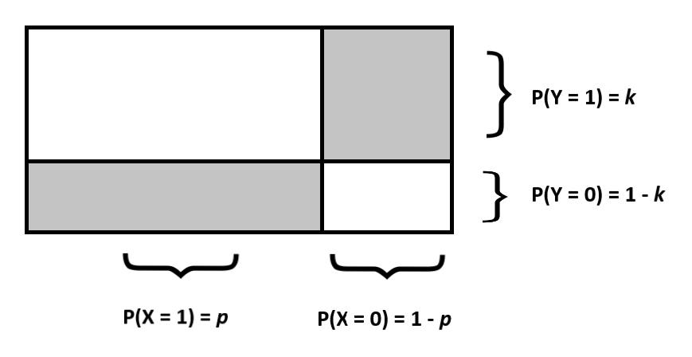

```{r setup, include=FALSE}
knitr::opts_chunk$set(echo = TRUE)
```

```{r, echo = F}
suppressWarnings(suppressMessages(library(knitr)))
suppressWarnings(suppressMessages(library(tidyverse)))
suppressWarnings(suppressMessages(library(ggpubr)))
suppressWarnings(suppressMessages(library(readr)))
suppressWarnings(suppressMessages(library(xtable)))
suppressWarnings(suppressMessages(library(gridExtra)))
suppressWarnings(suppressMessages(library(grid)))
opts_chunk$set(tidy.opts=list(width.cutoff=80),tidy=TRUE)
```
\pagenumbering{gobble}

\newpage
\pagenumbering{arabic}
# Introduction
|        League of Legends (abbreviated as LoL) is a multiplayer online battle arena game developed and published by Riot Games. In LoL, there are two teams of 5 players where the main objective of the game is to destroy the opposing team's "Nexus", a structure that is heavily defended in the center of each team's territory. Since LoL's inception in 2009, the game has experienced tremendous growth with over 100 million active monthly players in 2020. With such a large playerbase, LoL has developed an extremely active international professional scene. There are professional leagues worldwide such as in North America, Europe, China, South Korea, and many more regions for top level professional LoL. These professional leagues consist of teams that play one another in regional competitions which culminate with an annual World Championship. 

|        The initial goal of this paper is to model win probability specifically for professional teams in the North American region. The ability to predict match outcomes between two teams from win probabilities generated by a model is naturally a valuable tool for the betting industry. A significant amount of money is usually involved and people will always search for a slight edge in order to make more accurate predictions. In addition to benefitting the betting market, a model for win probability also provides insight into the game itself by identifying elements that have the most influence in determining a match's outcome. 

|        The second goal of the paper is to then simulate head to head matches between two professional North American teams using the win probabilities generated for each team from the model mentioned above. These simulations will follow Condorcet's model for majority voting. The original context in which Condorcet applies the majority voting model is in a courtroom where a jury must arrive at a $Yes$ decision. There are an odd number of voters in the jury and each voter has probability, $p$, of voting $Yes$ and probability, $1-p$, of voting $No$. Condorcet then determines the probability that the majority of voters vote $Yes$. In the context of LoL matches, an odd series of $n$ head to head matches played between two professional LoL teams will represent the number of voters in the jury. Similarly each game will have probability, $p$, of Team A winning and probability, $1-p$, of Team B winning. I wish to determine the probability that Team A will win the majority of their games against Team B. For example, if there is a series of five games that the teams must play, I wish to find the probability that Team A wins the majority of these five games. I will then verify Condorcet's Jury Theorem in the context of LoL matches. This section of the paper involving Condorcet's Jury Theorem and his model for majority voting will be discussed in more detail after the creation and explanation of the win probability model.

# Derivation & Explanation of Win Probability Model
|        A logistic regression model will be used to model win probability since the dependent observation we wish to observe, match outcome, is binary with values being either 1 (win) or 0 (loss). Thus match outcome, follows a Bernoulli distribution with unknown probability, $p$. The logistic regression model will estimate the value of $p$ for any given linear combination of independent variables that we choose for our model. The independent variables chosen for our model will be the following selected data for any given match:

* towerKills: The amount of enemy towers each team destroys
* baronKills: The number of times a team killed Baron Nashor
* deaths: The total death count for each team 
* gold_spent_percentage_diff: The percentage difference of gold spent between a team and the opposing team

\newpage
From our chosen independent variables, we can then construct the following linear equation to estimate the natural log of the odds ratio of winning a match:

\singlespacing
\begin{gather*}
\ln{\dfrac{p}{1-p}} = \beta_1towerKills + \beta_2baronKills + \beta_3deaths + \beta_4gold\_spent\_percentage\_diff + \beta_0 \\
p = \text{probability of winning the match}
\end{gather*}

\doublespacing
This equation is known as the logit in logistic regression and is derived from Bayes' Theorem. The logit is the link between the linear equation of independent variables to the dependent variable's Bernoulli distribution. The full derivation of the logit from Bayes' Theorem is as follows:

\singlespacing
\begin{align*}
&\text{First we define the probabilities that we will work with:} \\
\\
&P(Y \mid X) = \text{posterior probability of winning a match given input data} \\
&\text{from our linear equation of independent variables} \\
&P(X \mid Y) = \text{probability of having certain input data values given that we won the match} \\
&P(Y) = \text{prior probability of winning a match} \\
&P(X) = \text{probability of having a certain set of input data in our linear model} \\
\end{align*}

\doublespace
The probability that we are interested in is, $P(Y \mid X)$, because this represents the win probability given any input data into our linear model. Estimating this probability is the purpose of creating a logistic regression model. To accomplish this, we solve this equation which is the formula for Bayes' Theorem:

\singlespacing
\begin{gather*}
P(Y \mid X) = \frac{P(X \mid Y)P(Y)}{P(X)}
\end{gather*}

\singlespacing
\begin{align*}
&\text{We solve this equation by defining:} \\
\\
&P(\bar{Y}) = \text{prior probability of losing a match} \\
\\
&\text{We then rewrite our original equation in terms of the odds ratio of winning the match given input data:} \\
\\
&\frac{P(Y \mid X)}{P(\bar{Y} \mid X)} = \frac{P(X \mid Y)P(Y)\frac{1}{P(X)}}{P(X \mid \bar{Y})P(\bar{Y})\frac{1}{P(X)}} \\
&\frac{P(Y \mid X)}{P(\bar{Y} \mid X)} = \frac{P(X \mid Y)P(Y)}{P(X \mid \bar{Y})P(\bar{Y})} \\
\\
&\text{We can then simplify this equation in terms of odds ratios:} \\
\\
&O(Y \mid X) = \frac{P(X \mid Y)}{P(X \mid \bar{Y})}O(Y) \\
\\
&O(Y \mid X) = \text{odds ratio of winning a match given input data} \\
&O(Y) = \text{odds ratio of winning a match} \\
\\
&\text{We then take the natural log of both sides:} \\
\\
&\ln{(O(Y \mid X))} = \ln{(\frac{P(X \mid Y)}{P(X \mid \bar{Y})}O(Y))} \\
&\ln{(O(Y \mid X))} = \ln{\frac{P(X \mid Y)}{P(X \mid \bar{Y})}} + \ln{O(Y)}
\end{align*}

\doublespacing
We then have what appears to be a linear equation since $\ln{O(Y)}$ is a constant that does not depend on X which is our input data. This term will be treated as a constant. We then make the simplifying assumption that the natural log of the odds ratio is the linear function of independent variables that we initially created. Thus, we arrive at the equation:

\singlespacing
\begin{gather*}
logit(Y \mid X) = \beta_1towerKills + \beta_2baronKills + \beta_3deaths + \beta_4gold\_spent\_percentage\_diff + \beta_0
\end{gather*}

\doublespacing
We then take the inverse of the logit function and transform the odds ratio back into the posterior probability we are interested in, $P(Y \mid X)$. This is done as follows:

\singlespacing
\begin{align*}
&O(Y \mid X) = e^{\beta_1towerKills + \beta_2baronKills + \beta_3deaths + \beta_4gold\_spent\_percentage\_diff + \beta_0} \\
\\
&\text{Since the probability of winning a match conditional on some input data can be} \\
&\text{expressed in terms of its odds ratio as:} \\
\\
&P(Y \mid X) = \frac{O(Y \mid X)}{1 + O(Y \mid X)}
\\
&\text{We rewrite the inverse logit equation as:} \\
\\
&P(Y \mid X) = \frac{e^{\beta_1towerKills + \beta_2baronKills + \beta_3deaths + \beta_4gold\_spent\_percentage\_diff + \beta_0}}{1 + e^{\beta_1towerKills + \beta_2baronKills + \beta_3deaths + \beta_4gold\_spent\_percentage\_diff + \beta_0}} \\
\\
&P(Y \mid X) = \frac{1}{1 + e^{-(\beta_1towerKills + \beta_2baronKills + \beta_3deaths + \beta_4gold\_spent\_percentage\_diff + \beta_0)}}
\end{align*}

\doublespacing
|       Thus, we arrive at our logistic regression model where we are able to find win probabilities given inputs into our linear function. 

## Independent Variable Choice & Assumptions
I chose these four independent variables: 

* towerKills: The amount of enemy towers each team destroys
* baronKills: The number of times a team killed Baron Nashor
* deaths: The total death count for each team 
* gold_spent_percentage_diff: The percentage difference of gold spent between a team and the opposing team

to be included in my logistic regression model because they were all statiscally significant in determining win probability and had the largest effect on win probability during model experimentation and testing. towerKills and baronKills can be explained visually in Figure 1:

```{r, echo=FALSE, fig.cap = "Map of Summoner's Rift", out.width = '75%', fig.align = 'center'}
knitr::include_graphics("images/Summoner's Rift.png")
```

|       The green arrow in Figure 1 points to a neutral monster known as Baron Nashor. A team that manages to kill the Baron gains an advantage by becoming stronger which causes them to become more of a threat to the opposing team. The red arrow points to a structure known as a tower. Towers defend a team's territory. The more towers a team destroys, the further they can push into enemy territory to threaten to end the game by destroying the opposing team's Nexus. An important note to make about the variable, gold_spent_percentage_diff is that it is not the percentage change in gold spent. The formula for percentage difference is $\frac{\text{Team A Gold Spent - Team B Gold Spent}}{0.5(\text{Team A Gold Spent + Team B Gold Spent})}$. Percentage difference uses the average of both team's gold spending as the denominator instead of choosing either team. This method equally weighs the percent gold spent difference between the two teams. This variable will always be mirrored for opposing teams in the same match. For example, if Team A's gold spent percent difference is +15%, then Team B's gold spent percent difference will be -15%.

|       My claim that these variables form a linear relationship to win probability conditional on a set of inputs can be explained by observing a single variable in the linear model. If we suppose that our model only uses the variable gold_spent_percentage_diff (abbreviated as gspd) to model win probability, we can observe three distinct situations:

1. If gspd is 0%, it is reasonable to assume that an additional percent increase in gspd will be associated with some constant increase in win probability. A linear relationship is plausible in this situation. 
2. If gspd is at a high value such as +90%, then the probability of winning becomes so high that an additional percent increase or decrease in gspd will not greatly affect the win probability. This is because the team with gspd of +90% is so far ahead in terms of gold and character strength that the opposing team will have nearly no chance to mount a comeback and win the game. Thus, win probability flattens out for high values of gspd.
3. If gspd is at a low value such as -90%, then the probability of winning becomes extremely low so an additional percent increase or decrease in gspd will not affect the win probability. This is similar to situation two. Thus, win probability flattens out for low values of gspd.

These three situations suggest that the win probability curve follows a sigmoid, "S"-shaped, curve. This particular curve is exactly the type of curve seen in logistic regression models. Extending this analysis to the rest of our chosen independent variables and our multivariate linear function results in the same outcome as seen in the single linear case.

|       A key assumption that this logistic regression model makes can be found in the linear function that is used to approximate the natural log of the odds ratio of winning a match. The linear function assumes that the independent variables are completely exogeneous, meaning that they are not affected by each other. This is quite a large assumption since it is very unlikely that all the independent variables are exogenous. It is likely that they have some influence over one another. For example, the variable, baronKills may be correlated to towerKills. This is because most teams will often use the strength boost acquired by killing Baron as a tool to more easily destroy enemy towers. This is only one example where correlation can occur among our chosen independent variables. The endogeneity of our variables will not be a large issue if the correlation between them is weak. Table 1 displays a correlation matrix between our independent variables. The correlation between towerKills and gold_spent_percentage_diff is on the higher end at 0.703. Even though the other correlation values between the variables is not high, we should still be wary of the win probabilities generated from our logistic regression model.
```{r, echo=FALSE, message = FALSE, warning = FALSE}
match_data_extra = read_csv('match_data/aggregated_match_data.csv')
match_data_extra$win = as.factor(match_data_extra$win)

knitr::kable(cor(match_data_extra[ ,c('towerKills', 'baronKills', 'deaths', 'gold_spent_percentage_diff')]), format = "markdown",
             caption = 'Correlation matrix of independent variables')
```

## Data Collection & Model Results 
|       All of the data was collected from Riot's API. Through the API, I requested match data from the top 300 highest ranked players in North America. This distinction is important because I wanted to build a model that could be accurately applied to the highest level professional teams in North America. I randomly selected one ranked solo/duo queue match from each player. I then parsed each match for potential independent variables I could use for the logistic regression model and created additional variables on my own from existing data. Each match would then give me two rows of data, one from the winning team and one from the losing team. Each row had many columns of potential variables that could be used in the model. The end result was a dataframe with 600 rows and 34 columns. The final parsed dataset used to train the model was a dataframe with 600 rows and 4 columns. The first 6 rows of this dataframe are displayed in Table 2.
```{r, echo=FALSE}
knitr::kable(match_data_extra[1:6, c('towerKills', 'baronKills', 'deaths', 'gold_spent_percentage_diff')],
             caption = 'The first 6 rows of the aggregated match dataset')
```

|       From this final dataset, I randomly sampled 300 rows to serve as the training set and set aside the remaining 300 rows to serve as the test set. I then trained a logistic regression model using the training set and applied it to the test set. The model results can be seen in Table 3.

```{r, echo=FALSE}
training_indices = sample(nrow(match_data_extra), 300)

training = match_data_extra[training_indices, ] %>% 
  select(-c(match_id))
test = match_data_extra[-training_indices, ] %>% 
  select(-c(match_id))

logistic = glm(win ~ 
                 towerKills + baronKills + deaths + gold_spent_percentage_diff,
               data = training, 
               family = 'binomial')
logistic_coef = summary(logistic)$coefficients

logistic %>% 
  summary() %>% 
  xtable() %>% 
  kable(caption = 'Summary of logistic regression model')
```

Thus the finished logistic regression model can be written as:
\begin{gather*}
P(Y \mid X) = \frac{1}{1 + e^{-(`r round(logistic_coef[2, 1], 3)`towerKills + `r round(logistic_coef[3, 1], 3)`baronKills + `r round(logistic_coef[4, 1], 3)`deaths + `r round(logistic_coef[5, 1], 3)`gold\_spent\_percentage\_diff + `r round(logistic_coef[1, 1], 3)`)}}
\end{gather*}

|       The graph of predicted probabilities vs. the actual win result is displayed alongside the confusion matrix for both the test and training set in Figures 2 and 3.
```{r, echo=FALSE}
# Applying model to test/training set

### Test Set ###
pred_test = predict(logistic, test, type = 'response')

prediction_test_data = data.frame(
  win_prob = pred_test,
  result = test$win
)

prediction_test_data = prediction_test_data[
  order(prediction_test_data$win_prob), ]
prediction_test_data$rank = 1:nrow(prediction_test_data)

### Training Set ###
pred_training = predict(logistic, training, type = 'response')

prediction_training_data = data.frame(
  win_prob_training = pred_training,
  result_training = training$win
)

prediction_training_data = prediction_training_data[
  order(prediction_training_data$win_prob_training), ]
prediction_training_data$rank = 1:nrow(prediction_training_data)
```

```{r, fig.cap = 'Test Set', fig.align = 'center', fig.show = 'hold', out.width = '.49\\linewidth', echo = FALSE}
### Test Plot ###
ggplot(data = prediction_test_data, aes(x = rank, y = win_prob)) +
  geom_point(aes(color = result), alpha = 1, shape = 4, stroke = 2) +
  scale_fill_discrete(guide = guide_legend(reverse = TRUE)) + 
  xlab('Index') +
  ylab('Probability') +
  ggtitle('Probability of Winning vs Actual Win Result (Test Set)') + 
  theme(plot.title = element_text(hjust = 0.5)) +
  geom_hline(yintercept = 0.5)

test_confusion_matrix = table(prediction_test_data$result, prediction_test_data$win_prob > 0.5)
grid.newpage()
grid.table(test_confusion_matrix)
```

```{r, fig.cap = 'Training Set', fig.align = 'center', fig.show = 'hold', out.width = '.49\\linewidth', echo = FALSE}
### Training Plot ###
ggplot(data = prediction_training_data, aes(x = rank, y = win_prob_training)) +
  geom_point(aes(color = result_training), alpha = 1, shape = 4, stroke = 2) +
  scale_fill_discrete(guide = guide_legend(reverse = TRUE)) + 
  xlab('Index') +
  ylab('Probability') +
  ggtitle('Probability of Winning vs Actual Win Result (Training Set)') + 
  theme(plot.title = element_text(hjust = 0.5)) +
  geom_hline(yintercept = 0.5)

training_confusion_matrix = table(prediction_training_data$result, prediction_training_data$win_prob_training > 0.5)
grid.newpage()
grid.table(training_confusion_matrix)
```

\newpage
# Applying Condorcet's Model of Majority Voting
|       We can now generate win probabilities for different professional teams in North America using our logistic regression model. Since professional match data is not available through Riot's API, we obtain data recorded on third party websites. To generate a win probability for a professional team, we will observe a team's 10 most recent games played in North America and collect the neccessary data from each match. We then apply our model onto this dataset to obtain a win probability for each of the 10 matches. The team's win probability for a future match will then be the average of these 10 values. We repeat this process for another team of our choosing.

|       I will obtain the win probability for Cloud 9 (abbreviated as C9) and Team SoloMid (abbreviated as TSM). The win probability for each team after applying the above process is:
```{r, echo = FALSE, warning = FALSE, message = FALSE}
c9 = read_csv('match_data/c9_recent10.csv')
c9$win = as.factor(c9$win)
tsm = read_csv('match_data/tsm_recent10.csv')
tsm$win = as.factor(tsm$win)

c9_win_prob = predict(logistic, c9, type = 'response')
c9_avg = round(mean(c9_win_prob), 3)
tsm_win_prob = predict(logistic, tsm, type = 'response')
tsm_avg = round(mean(tsm_win_prob), 3)
```
* C9 = `r c9_avg`
* TSM = `r tsm_avg`

We can then use each team's win probability to simulate head to head matches and apply Condorcet's majority model to determine the probability of C9 winning the majority of the games played in a series of $n$ games against TSM. Condorcet's model was initially used as a voting model. The simplest version of this voting model uses these parameters:

* Suppose there are an odd number of voters, $2m + 1$, where $m \in \mathbb{N}$
* There are only two outcomes on a vote, either Yes or No.
* Votes are uncorrelated between voters
* Each voter votes Yes with probability $p$ and No with probability $1 - p$

We observe that the outcome for each vote is a Bernoulli random variable. The number of voters who vote Yes follows a binomial distribution since there are $2m + 1$ voters where each vote follows a Bernoulli distribution with probability $p$. The probability that the majority of voters vote Yes can be described as $\sum^{2m+1}_{i=m+1} {2m+1 \choose i}p^{i}p^{2m+1 - i}$. In the context of LoL, C9 amd TSM will play a series to determine a winner. Series consist of an odd number of matches. The team who wins the majority of the matches played in the series is the winner. Thus, each match is a Bernoulli random variable where $p$ is the probability that C9 wins and $1 - p$ is the probability that TSM wins. Similarly, the number of matches C9 wins follows a binomial distribution.

|       Each match between C9 and TSM must be a Bernoulli random variable in order to apply Condorcet's model. We observe that this is not the case since the probabilities of C9 winning and TSM winning is greater than 1. The process for turning these probabilities into $p$ and $1 - p$ is as follows:

\singlespacing

\begin{multicols}{2}

  \begin{minipage}{.5\textwidth}
    \text{Let X be a Bernoulli random variable} \\
    \text{with probability `r c9_avg` if C9 wins} \\
    \text{and probability `r 1 - c9_avg` if C9 loses.} \\
    \[ X = \begin{cases}
      \text{1 (C9 wins)} & \text{with probability `r c9_avg`} \\
      \text{0 (C9 loses)} & \text{with probability `r 1 - c9_avg`} \\
      \end{cases}
    \]
  \end{minipage}
  
  \begin{minipage}{.5\textwidth}
  \text{Let Y be a Bernoulli random variable} \\
  \text{with probability `r tsm_avg` if TSM wins} \\
  \text{and probability `r 1 - tsm_avg` if TSM loses.} \\
  \[ Y = \begin{cases}
    \text{1 (TSM wins)} & \text{with probability `r tsm_avg`} \\
    \text{0 (TSM loses)} & \text{with probability `r 1 - tsm_avg`} \\
    \end{cases}
  \]
  \end{minipage}

\end{multicols}

\begin{align*}
\therefore\quad &\text{P(C9 wins against TSM) = P(X = 1, Y = 0) = `r c9_avg` * `r 1 - tsm_avg`} \\
&\text{P(TSM wins against C9) = P(X = 0, Y = 1) = `r 1 - c9_avg` * `r tsm_avg`}
\end{align*}

Then, we let Z be a Bernoulli random variable with probability mass function:
\[ Z = \begin{cases}
   \text{1 (C9 beats TSM)} & \text{with probability}\ \frac{`r c9_avg` * `r 1-tsm_avg`}{(`r c9_avg` * `r 1-tsm_avg`) + (`r 1-c9_avg` * `r tsm_avg`)} \\
   \text{0 (TSM beats C9)} & \text{with probability}\ \frac{`r 1-c9_avg` * `r tsm_avg`}{(`r c9_avg` * `r 1-tsm_avg`) + (`r 1-c9_avg` * `r tsm_avg`)} \\
   \end{cases}
\]

```{r, echo = FALSE}
c9_beat_tsm = round((c9_avg * (1-tsm_avg)) / ((c9_avg * (1-tsm_avg)) + ((1-c9_avg) * tsm_avg)), 3)
tsm_beat_c9 = round(((1-c9_avg) * tsm_avg) / ((c9_avg * (1-tsm_avg)) + ((1-c9_avg) * tsm_avg)), 3)
```

\begin{align*}
\therefore\quad &\text{P(C9 beats TSM) = `r c9_beat_tsm`} \\
&\text{P(TSM beats C9) = `r tsm_beat_c9`}
\end{align*}

\newpage
```{r, echo=FALSE, fig.cap = 'Intuition behind combining win probabilities', out.width = '50%', fig.align = 'center'}

```

\doublespacing
The intuition behind combining the two win probabilities is displayed in Figure 4. Let the rectangular box represent the sample space, $\Omega$. Let the event that C9 wins a match and the event that C9 loses a match be represented by the two slices of the box separated by the vertical line. Then the respective probabilities for each event is $p$ and $1 - p$. Let the event that TSM wins a match and the event that TSM loses a match be represented by the two slices of the box separated by the horizontal line. The respective probabilities will then be $k$ and $1 - k$. Thus the probability that C9 beats TSM can be described as the probability that C9 wins and TSM loses conditioned on the fact that there is only one winner. The probability that C9 beats TSM can be described mathematically as $P(X=1,Y=0|X+Y=1)$. Similarly, the probability that TSM beats C9 can be described as $P(X=0,Y=1|X+Y=1)$. This calculation is done when we create the random variable $Z$ as seen above.

## Assumptions
|       One important assumption that is made when combining the win probabilities is that the events of C9 winning and TSM winning are independent. This may not always be the case. For example, if C9 is known to lose most of their matches against TSM, the events are not independent and the combined probabilities will not be accurate. Another assumption made is that the probability that C9 beats TSM is independent and does not change throughout all the matches that are played. This assumption is similar to votes being uncorrelated between voters as proposed in the initial example introducing Condorcet's model.

## Results
|       The histograms below display the binomial distribution representing the number of matches that C9 wins against TSM. The size of each binomial distribution represents a series which consists of an odd number of $2m + 1$ matches. The probability of C9 winning the series, which is the majority of the matches played, is the sum of the probabilities of C9 winning $m + 1, ..., 2m + 1$ matches. This is visually displayed with the histograms below. As the number of matches played increases, we observe that the variance decreases. Thus, the probability that C9 wins the series increases if more matches are played. This observation is a result of Condorcet's jury theorem. If the probability of C9 beating TSM is greater than $\frac{1}{2}$, then increasing the number of matches played will increase the probability that C9 wins the majority of the matches. Thus the probability that C9 wins the majority of the matches approaches 1 as the number of matches increases. Alternatively, if the probability of C9 beating TSM is less than $\frac{1}{2}$, the probability that C9 wins the majority of matches approaches 0 as the number of matches increases.

```{r, echo = FALSE, out.width = '90%', fig.align = 'center'}
# Create binomial pmfs of different series length with probability = c9_beat_tsm
pmf_list = list()
for (i in c(3, 7, 11, 101)){
  if (i == 101) {
    x = 0:i
    binom_dat = data.frame(matches_won = factor(x), prob = dbinom(x, size = i, prob = c9_beat_tsm))
    
    my_plot = ggplot(binom_dat, aes(x = matches_won, y = prob)) +
      geom_bar(stat = 'identity', col = 'dodgerblue1', fill = 'dodgerblue1') +
      scale_x_discrete(breaks = seq(0, 101, by = 10)) +
      labs(title = paste('Binomial Distribution with n =', i),
           subtitle = paste('Bin(', i, ', ', c9_beat_tsm, ')', sep = ''),
           x = '# Matches Won',
           y = 'Probability')
  } else {
    x = 0:i
    binom_dat = data.frame(matches_won = factor(x), prob = dbinom(x, size = i, prob = c9_beat_tsm))
    
    my_plot = ggplot(binom_dat, aes(x = matches_won, y = prob)) +
      geom_bar(stat = 'identity', col = 'dodgerblue1', fill = 'dodgerblue1') +
      labs(title = paste('Binomial Distribution with n =', i),
           subtitle = paste('Bin(', i, ', ', c9_beat_tsm, ')', sep = ''),
           x = '# Matches Won',
           y = 'Probability')
  }
  
  pmf_list = c(pmf_list, list(my_plot))
}
ggarrange(pmf_list[[1]], pmf_list[[2]], pmf_list[[3]], pmf_list[[4]], ncol = 2, nrow = 2)

```

The empirical verification of Condorcet's jury theorem is displayed in Table 4. As the length of the series increases, the probability increases. This is because the initial probability, $P(\text{C9 beats TSM}) = `r c9_beat_tsm`\ > \frac{1}{2}$.

```{r, echo = FALSE}
# Table displaying probability of C9 winning the majority of their games in a best of n series
knitr::kable(data.frame(x = c(3, 7, 11, 101), y = c(pbinom(q = 1, size = 3, prob = c9_beat_tsm, lower.tail = FALSE),
                                                    pbinom(q = 3, size = 7, prob = c9_beat_tsm, lower.tail = FALSE),
                                                    pbinom(q = 5, size = 11, prob = c9_beat_tsm, lower.tail = FALSE),
                                                    pbinom(q = 50, size = 101, prob = c9_beat_tsm, lower.tail = FALSE))) %>% 
               rename('Series Length' = x,
                      'Probability' = y),
             caption = 'Probability table of C9 winning majority of matches for different series'
)
```

# Conclusion
|       This project was an attempt at modeling win probability for professional North American teams with the intention of using these probabilities to determine the outcome of a series of head to head matches between two different teams. An important note to make is that the analysis done in the paper is a post-hoc analysis of the game. The logistic regression model takes in data from matches that have already occurred in order to predict outcomes of future matches. The analysis done in this paper focused on the North American region. It would be interesting to observe any potential changes to the logistic regression model with the inclusion of data from all the major regions worldwide. In the Condorcet section of the paper, data is taken from the most recent 10 matches for each team. A more sophisticated approach could include a correction factor that accounts for the strength of each opponent that a team plays. For example, if a team won their recent 10 matches against highly rated teams, their final win probability would be higher to account for this fact.

\newpage
\pagenumbering{gobble}
# References

\singlespacing
Bouzianis, Stephen. “Predicting the Outcome of NFL Games Using Logistic Regression.” *UNH Scholars' Repository*, University of New Hampshire, 2019, scholars.unh.edu/cgi/viewcontent.cgi?article=1472&amp;context=honors.

Hubbard, Chandler. “Esports Win Probability: A Role Specific Look into League of Legends.” *Samford University Center for Sports Analytics*, Samford University, 27 May 2020, www.samford.edu/sports-analytics/fans/2020/Esports-Win-Probability-A-Role-Specific-Look-into-League-of-Legends.

Kurt, Will. “Logistic Regression from Bayes' Theorem.” *Count Bayesie*, 13 June 2019, www.countbayesie.com/blog/2019/6/12/logistic-regression-from-bayes-theorem. 

Quintana, Diego Angulo. “Predicting Wins in League of Legends.” *RPubs*, Rstudio, 30 Aug. 2019, rpubs.com/diegolas/LogisticLoL.

Simonof, Jeffrey  S. “Logistic Regression — Modeling the Probability of Success.” *NYU Stern*, NYU, 2018, people.stern.nyu.edu/jsimonof/classes/2301/pdf/logistic.pdf. 
